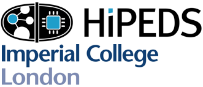

<!--Register now!-->
<!--------->
<!--We are proud to announce that the Imperial College Computing Student Workshop (ICCSW) is back this year!-->

<!--This year, thanks to our wonderful sponsors **Google and Imperial College HiPEDs**, we will be hosting two days of student talks, including a poster session, 2 keynotes and a social night.-->

<!--What you need to know:-->

<!--📅 20th - 21th Sept, starting at 10AM.  -->
<!--🎤 Student talks on a variety of Computing topics.  -->
<!--✨ Student Poster session breakfast  🥐     -->
<!--🔑 2 great keynotes:  -->
<!--&nbsp;&nbsp;👉 Optimising the unoptimisable - The V8 JavaScript Engine, Leszek Swirski from Google.  -->
<!--&nbsp;&nbsp;👉 How to write a great paper, Simon Peyton Jones from Microsoft Research  -->
<!--🍴 Student Social event and dinner on evening of 26th Sept.  -->
<!--🍕 Free lunches and social dinner for registered attendees.  -->
<!--🎯 Register now here: https://iccsw17.eventbrite.com  -->
<!--❗ Why haven't you registered yet -  it's free, go register now!  -->

---
Call for Papers and Posters
-----
This year at ICCSW’18 we’re hosting a student poster session and would love to see **_your work_**!

Whether you’re just about to survive your first year or driving for the finish, ICCSW’18 is the place to present and show off your ~~constantly evolving it’s-not-ready-yet-work-in-progress~~ masterpiece.

----------
The 2018 Imperial College Computing Student Workshop aims to provide an
international forum for doctoral students to discuss a range of topics
that are current in computer science research. The workshop welcomes all
research students in the field of computer science.

Following the success of the sixth editions of the
workshop&mdash;[ICCSW'17](http://iccsw.doc.ic.ac.uk/2017);
<!--[ICCSW'15](http://iccsw.doc.ic.ac.uk/2015), [ICCSW'14](http://iccsw.doc.ic.ac.uk/2014), [ICCSW'13](http://iccsw.doc.ic.ac.uk/2013), [ICCSW'12](http://iccsw.doc.ic.ac.uk/2012) and [ICCSW'11](http://iccsw.doc.ic.ac.uk/2011)&mdash;-->
the seventh workshop provides an excellent opportunity to share provocative ideas,
interesting preliminary work, or a cool research directions that may
change the world.

The workshop aims to:

* offer research students the opportunity to submit and present their
  research at an internationally-renowned institution;
* provide PhD students with the experience of organising a workshop,
  including reviewing papers written by other students;
* provide a forum for open discussion of topics including those outside
  the current focus of research;
* allow students to network with peers from other institutions and learn
  about their research.

The workshop provides an excellent ground for discussing similarities
and differences in graduate studies at various institutions around the
world. All doctoral students are thereby encouraged to submit papers
covering their ongoing research. The sixth edition of the workshop is
currently being planned.

The proceedings will be published as an [OpenAccess Series in Informatics](http://www.dagstuhl.de/en/publications/oasics) volume.

#### IMPORTANT DATES

<!--* Abstract submission:-->
* Paper submission: 6th July. 2018
* Notification of paper acceptance: 27 July 2018
* Paper camera ready: TBC
* Poster submission: 3rd August. 2018
* Workshop: 20th and 21th Sept. 2018

#### SUBMISSION

Papers must be written in English, using the [OASIcs](http://drops.dagstuhl.de/styles/oasics/oasics-authors.tgz) template and submitted through [https://easychair.org/conferences/?conf=iccsw18](https://easychair.org/conferences/?conf=iccsw18). 

Page limits are as follows:

* Traditional track: up to 6 pages, excluding references and clearly marked appendices.
* Poster session: A1 size, portrait or landscape

<!-- # Prize Winners

* Best Paper:
* Best Presentation:
* Best Reviewer:  -->

<!-- --- -->
<!-- 

	<h2 style="font-weight: bold;color:#FFF;margin:0px;">
		2015 ICCSW Keynote speakers:
	</h1>

	<h3 style="font-style: italic;">
		[Chris DiBona (Google)](https://sites.google.com/a/dibona.com/www/) and [Erik Mueller (MIT)](http://xenia.media.mit.edu/~mueller/)
	</h3>

 -->

---

### Sponsors

<!--
-->
<!--<a href="http://www.google.com/about/">-->
  <!---->
<!--</a>-->
<!--<a href="http://wp.doc.ic.ac.uk/hipeds/">-->
  <!---->
<!--</a>-->
<!--
-->

### Supporters

