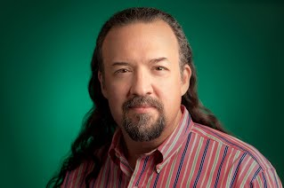

### To be announced
<!--

	<h2 style="font-weight: bold;color:#FFF;margin:0px;">
		Going Beyond Fact-Based Question Answering
	</h2>
	<h4 style="text-align: right;font-weight: bold;color:#FFF;margin:0px;">
		[Erik T. Mueller (MIT)](http://xenia.media.mit.edu/~mueller/)
	</h4>

	

		 To solve the AI problem, we need to develop systems that go beyond
		  answering fact-based questions. Watson has been hugely successful
		  at answering fact-based questions, but to solve hard AI tasks like
		  passing science tests and understanding narratives, we need to go
		  beyond simple facts. In this talk, I discuss how the systems I have
		  most recently worked on have approached this problem. Watson for
		  Healthcare answers Doctor's Dilemma medical competition questions,
		  and WatsonPaths answers medical test preparation questions. These
		  systems have achieved some success, but there is still a lot more
		  to be done. Based on my experiences working on these systems, I
		  discuss what I think the priorities should be going forward. First,
		  to deal with the richness of human knowledge, we need to move beyond
		  propositional logic to predicate logic. Second, to deal with the
		  real world, we need to represent and reason about events and time.
		  Third, to find multiple solutions and keep them distinct from one
		  another, we need to use declarative problem solving methods like
		  answer set programming. As one example of a formalism that embodies
		  these three things, I review the event calculus described in my
		  book Commonsense Reasoning. This formalism is especially useful for
		  the narrative understanding task.

	

    

        <iframe width="560" height="315" src="https://www.youtube.com/embed/jFOeOXeXw1c" frameborder="0" allowfullscreen></iframe>
    

The keynote will take place at Lecture Theatre 3 of Blackett Building at 14:00 on Friday, 25th September.

	<h3> About [Erik T. Mueller (MIT)](http://xenia.media.mit.edu/~mueller/) </h3>
	

		Erik Mueller was a member of the IBM team that developed the Watson
		Jeopardy! system, Watson for Healthcare, and WatsonPaths. He developed
		the discrete event calculus to improve the efficiency of automated
		commonsense reasoning using the event calculus, a logical formalism
		for reasoning about action and change. He developed the open source
		Discrete Event Calculus Reasoner and wrote the book Commonsense
		Reasoning, a comprehensive guide to the field for researchers and
		students. Erik also developed DAYDREAMER, a cognitive architecture
		that models human daydreaming, and ThoughtTreasure, a commonsense
		knowledge base and architecture for natural language processing.
		Erik received his S.B. in Computer Science and Engineering from the
		Massachusetts Institute of Technology and my M.S. and Ph.D. in
		Computer Science from the University of California, Los Angeles.

	

	

		 
	

 

	<h2 style="font-weight: bold;color:#FFF;margin:0px;">
		Google and Open Source
	</h2>
	<h4 style="text-align: right;font-weight: bold;color:#FFF;margin:0px;">
		[Chris DiBona (Google)](https://sites.google.com/a/dibona.com/www/)
	</h4>

	

  In this talk Chris DiBona will review Google’s use of open source projects and the history of prominent releases like Android, Chromium, Angular.js and some 3500 other projects (though not all of them will be surveyed!). Keeping such releases on track and efficient and , in some cases, retiring them has been his focus since he started at the company. He’ll review the various ways Google supports the worldwide community of software developers that it has derived so much value from.

Specifically for the students assembled, Mr. DiBona will also talk about the university oriented program “The Summer of Code” which is designed to lure students into open source projects and provide for them the real world mentorship they need to become open source committers themselves. A paid internship that lasts approximately 3 months during the summer months, The Summer of Code has introduced over 10,000 developers in 123 countries to open source software development and added over 30 million lines of code to open source projects that Google and the students use every day of their lives.
	

    

        <iframe width="560" height="315" src="https://www.youtube.com/embed/Y89fJyMyZDU" frameborder="0" allowfullscreen></iframe>
    

The keynote will take place at Lecture Theatre 3 of Blackett Building at 14:00 on Thursday, 24th September.

	<h3> About [Chris DiBona (Google)](https://sites.google.com/a/dibona.com/www/) </h3>

		

			Chris DiBona is the Director of Open Source for Mountain View, Ca. based <a href="http://google.com">Google</a>. His teams oversees license compliance and supports the open source developer community through programs such as the <a href="http://code.google.com/soc">Google Summer of Code</a> and through the release of open source software projects and patches. Additionally, he looks after Google Making Science, an emerging scientific outreach program. For <a href="http://www.google.com/ideas/">Google Ideas</a>, he looks after <a href="https://www.uproxy.org/" rel="nofollow">Uproxy</a> and <a href="http://www.google.com/ideas/projects/project-shield/">Project Shield</a>, among other programs. 
			 

			Mr. DiBona is an internationally known advocate of open source software and related methodologies. He occasionally appears on the <a href="http://twit.tv" rel="nofollow">This Week in Tech</a>  and the <a href="http://twit.tv/twig" rel="nofollow">This Week in Google</a> podcasts. He is a visiting scientist at the <a href="http://sloan.mit.edu" rel="nofollow">MIT Sloan School of Management</a> and has a masters in software engineering from <a href="http://www.cmu.edu" rel="nofollow">Carnegie Mellon University</a>. Additionally, he serves as an <a href="http://www.dibona.com/www/full-disclosure" rel="nofollow">advisor</a> to a number of firms.  
			 

			Before joining Google, Mr. DiBona was an editor and author for the website <a href="http://slashdot.org/" rel="nofollow" target="_blank">Slashdot.org</a> . Additionally, he co-edited the award-winning essay compilations "<a href="http://www.oreilly.com/catalog/opensources/book/toc.html" rel="nofollow">Open Sources</a>" and "<a href="http://www.oreilly.com/catalog/opensources2/" rel="nofollow">Open Sources 2.0</a>" and writes for several publications. He was the host of <a href="http://twit.tv/FLOSS" rel="nofollow">Floss Weekly</a> with Leo Laporte and made a number of appearances on TechTV's "The Screensavers" and on the <a href="http://www.crankygeeks.com/" rel="nofollow" style="color:rgb(85,26,139)">Cranky Geeks</a>.  
			 

			His personal blog can be found via <a href="http://dibona.com/" rel="nofollow">http://dibona.com</a> and he can be reached via email via <a href="mailto:chris@dibona.com">chris@dibona.com</a>. Also available is a profile on <a href="http://en.wikipedia.org/wiki/Chris_DiBona" rel="nofollow">wikipedia</a> and <a href="https://twitter.com/cdibona" rel="nofollow">twitter feed</a> which you can follow.<h3><a name="TOC-How-to-use-this-Bio:">
		

		

			 
		

	

 -->

